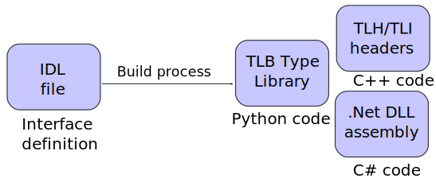

Examples of language-neutral [Component Object Model (COM)](https://learn.microsoft.com/en-us/windows/win32/com/the-component-object-model) interfaces for [IPC](https://en.wikipedia.org/wiki/Inter-process_communication).

Repo content:

| Module       | Description                                 |
|--------------|---------------------------------------------|
| ComSupport   | .Net support functions for COM registration |
| MyInterfaces | Language-neutral COM interface definitions for IPC ([MyInterfaces.idl](MyInterfaces/MyInterfaces.idl)) |
| MyClientCpp  | Sample C++ client |
| MyClientCs   | Sample C# client |
| MyClientPy   | Sample Python client |
| MyServerCpp  | C++ server implementation. Implemented as an on-demand loaded COM EXE server. The process can also be started manually to facilitate background service deployment. |
| MyServerCs   | C# server implementation. Implemented as an on-demand loaded COM EXE server. The process can also be started manually to facilitate background service deployment. |

Based on https://github.com/dotnet/samples/tree/main/core/extensions/OutOfProcCOM


## COM description

Interface definition and C++/C# integration workflow:  


#### COM strengths:
* **Language neutral** interface definitions.
* COM is **in-built in Windows**. There's no need to install any additional "runtime" or "brokers". COM is used for GPU programming with Direct3D, HW diagnostics with WMI and most new Windows features are exposed through COM-based [WinRT](https://github.com/microsoft/xlang) interfaces.
* Support for **type-safe** interfaces where type mismatches are detected at compile-time instead of run-time.
* Support for bidirectional **object-oriented** communication.
* Support for **interface versioning** for controlled API evolution.
* **Transparent IPC marshaling** of method calls. The client doesn't need to know that an object resides in a different process.
* Languages like C++, C# and Python natively support COM, which **avoids** the need for any manually maintained **language bindings**.
* **Rock solid** technology that has been available since 1993.
* Inherently **secure** with design protection against remote attacks. Does unlike sockets _not_ depend on opening any ports that need to be secured through authentication and firewall lockdown. Security settings are furthermore highly configurable.

#### COM limitations:
* Best practice is poorly documented.
* Not as easily available on non-Windows platforms. The [MiniCOM](https://github.com/forderud/MiniCOM) project can partly mitigate this for in-process needs.

### Exception mapping
Both C++ and .Net can automatically map COM `HRESULT` error codes to exceptions, so that developers doesn't need to explicitly check each call for failure.

#### Details:
* **.Net**: `HRESULT` error codes are automatically [mapped to comparable .Net exceptions](https://learn.microsoft.com/en-us/dotnet/framework/interop/how-to-map-hresults-and-exceptions).
* **C++** with generated TLH-wrappers: `HRESULT` error codes are automatically mapped to [`_com_error`](https://learn.microsoft.com/en-us/cpp/cpp/com-error-class) exceptions. It's still possible to call the "old" HRESULT versions by adding a `raw_` prefix to the method names.

### Threading
COM clients and servers can decide their [threading model](https://learn.microsoft.com/en-us/troubleshoot/windows/win32/descriptions-workings-ole-threading-models) for _incoming_ calls by configuring the thread associated with the class(es) receiving callbacks to run in either:
* **Single-threaded apartment (STA)**[1]: Incoming calls are automatically serialized. This means that the client doesn't need to worry about thread safety, since the COM runtime is ensuring that only one incoming call is received at a time.
* **Multi-threaded apartment (MTA)**: Incoming calls are _not_ serialized and might arrive concurrently. This means that the client need to use mutexes or similar to protect against race conditions.

[1] STA threads need to [pump messages](https://learn.microsoft.com/en-us/windows/win32/winmsg/using-messages-and-message-queues) to process incoming calls - just like all GUI applications does to process mouse & keyboard events. The implementation then needs to take into account that _reentrancy can occur_ as part of the message pumping _if_ pumping messages while processing an incoming call.

## How to test
1. Ensure that you have a [Python](https://www.python.org/) interpreter associated with `.py` files.
1. Open the solution in [Visual Studio](https://visualstudio.microsoft.com/).
1. Build all projects.
1. Register the server:
    * Either run `MyServerCs.exe" /regserver`  with admin privileges,
    * Or run `MyServerCpp.exe" /regserver`  with admin privileges.
1. Run the test clients:
    * C++: run `MyClientCpp.exe`
    * C#: run `MyClientCs.exe`
1. **Un**register the server to clean up:
    * Either run `MyServerCs.exe" /unregserver` with admin privileges,
    * Or run `MyServerCpp.exe" /unregserver`  with admin privileges,
    * Or run `UNREGISTER.bat` with admin privileges.

Server registration is only needed for on-demand loaded COM EXE servers and can be skipped if instead running the server in a background service that is auto-started. In that case, the TypeLib will still need to be registered at server startup.

The client programs should output something resembling this:
```
pi = 3.141592653589793
Received message:
  sev=Info
  time=7/4/2023 10:27:57 AM
  value=1.23
  desc=Hello there!
  color=(255, 0, 0)
  data=[0,1,2,3]
...
```
